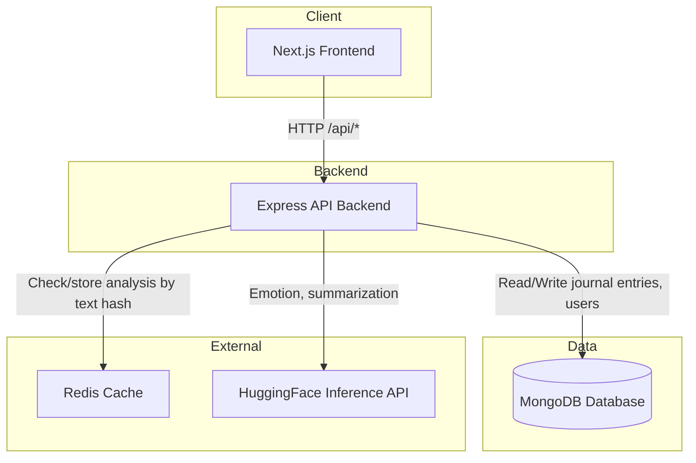

# SylvanMind

SylvanMind is an AI-assisted journaling app for reflective writing and nature-based wellness. It helps users capture thoughts in a calm, ambient context and understand patterns in their writing through emotion analysis, keyword extraction, and summarization—without locking them into a single vendor or heavy infrastructure.

---

## Features

- **Journal entries** — Write entries with an optional ambience (forest, ocean, mountain). Entries are stored per user and listed newest first.
- **Emotion analysis** — On-demand analysis of journal text for emotional tone (e.g. joy, sadness, anger, neutral) via HuggingFace.
- **Keyword extraction** — TF-IDF–based keyword extraction from the same text, run locally with no external API.
- **Journaling insights** — Aggregated view of a user’s journal: total entries, most frequent emotion, most used ambience, and recent keywords.

---

## How It Works

1. **Write** — User submits journal text (and ambience) via the frontend; the backend stores it in MongoDB.
2. **Analyze** — When the user clicks “Analyze,” the backend:
   - Optionally checks Redis for a cached result (key = SHA256 of trimmed text).
   - On cache miss: calls HuggingFace for emotion and summarization, runs keyword extraction with `natural`, merges the result, and caches it for 24 hours.
   - Returns `{ emotion, keywords, summary }` to the client.
3. **Insights** — The insights endpoint aggregates stored entries by user (counts, top emotion, top ambience, recent keywords from stored analysis).

---

## Tech Stack

| Layer    | Technologies |
|----------|--------------|
| Backend  | Node.js, Express, TypeScript, MongoDB (Mongoose), Redis |
| Frontend | Next.js 14 (App Router), React, TypeScript, Tailwind CSS |
| NLP      | HuggingFace Inference API (emotion, summarization), natural (TF-IDF keywords) |
| Cache    | Redis (analysis results keyed by SHA256 of text; optional) |

---

## System Architecture



The frontend talks only to the Express API. The API persists data in MongoDB, caches analysis results in Redis, and calls HuggingFace for emotion and summarization when analyzing text. See [docs/architecture.md](docs/architecture.md) for component details.

---

## Project Structure

```
├── backend/
│   └── src/
│       ├── controllers/   # Request handlers (journal, analyze, insights)
│       ├── middleware/    # Error handling, etc.
│       ├── models/        # Mongoose schemas (User, JournalEntry)
│       ├── routes/        # API route definitions
│       ├── services/      # Business logic (journal, analysis, insights, HuggingFace)
│       ├── utils/         # Validation, cache, env, errors
│       ├── scripts/       # Seed script for development
│       ├── app.ts         # Express app setup
│       └── index.ts       # Server entry
├── frontend/
│   ├── app/               # Next.js App Router (pages, layout)
│   ├── components/        # Reusable UI components
│   ├── lib/               # API client, hooks (e.g. useUserId)
│   └── public/
├── ARCHITECTURE.md        # Scaling, caching, privacy notes
├── docs/               # Documentation and demo screenshots (see docs/SCREENSHOTS.md)
├── ARCHITECTURE.md     # Scaling, caching, privacy notes
└── README.md
```

---

## Demo Screenshots

| Journal editor | Analysis results | Insights dashboard |
|----------------|------------------|--------------------|
|  |  |  |

*Placeholder images: add `docs/editor.png`, `docs/analysis.png`, and `docs/insights.png` per [docs/SCREENSHOTS.md](docs/SCREENSHOTS.md) to show the journal editor, analysis results, and insights dashboard.*

---

## Demo

A short GIF can show the main flow in one place:


**Adding the GIF:** Save your recording as `docs/demo.gif`. The GIF should include:

1. **Writing a journal entry** — Type a few sentences in the Journal editor, choose an ambience (forest, ocean, or mountain), and save.
2. **Running emotion analysis** — Click **Analyze** on the Journal page and show the result (emotion, keywords, summary).
3. **Viewing insights** — Open the Insights page and show the dashboard (total entries, top emotion, most used ambience, emotion distribution, recent keywords).

Keep the clip short (e.g. 15–30 seconds). Use a screen recorder (e.g. LICEcap, ScreenToGif, or your OS built-in tool), then export as GIF and place at `docs/demo.gif`.

---

## API Endpoints

Base URL: `/api`. All JSON. Success responses that return a resource or list use a `data` wrapper; analysis returns a flat object.

| Method | Path | Description |
|--------|------|-------------|
| `GET`  | `/api/health` | Health check. |
| `POST` | `/api/journal` | Create a journal entry. |
| `GET`  | `/api/journal/:userId` | List entries for `userId`, newest first. |
| `POST` | `/api/journal/analyze` | Analyze journal text (emotion, keywords, summary). Cached when Redis is available. |
| `GET`  | `/api/journal/insights/:userId` | Aggregated insights for `userId`. |

**Validation:** Create entry requires non-empty `text`, `ambience` in `forest` | `ocean` | `mountain`, and `userId`. Analyze requires non-empty `text`. List and insights require `userId` as a valid 24-char hex MongoDB ObjectId.

---

### POST /api/journal — Create a journal entry

**Request**

```http
POST /api/journal
Content-Type: application/json
```

```json
{
  "userId": "674a1b2c3d4e5f6789abcdef",
  "text": "Morning walk in the woods. The light through the leaves and the sound of birds made everything else fade away.",
  "ambience": "forest"
}
```

**Response** `201 Created`

```json
{
  "data": {
    "_id": "674a1b2c3d4e5f6789abc123",
    "userId": "674a1b2c3d4e5f6789abcdef",
    "text": "Morning walk in the woods. The light through the leaves and the sound of birds made everything else fade away.",
    "ambience": "forest",
    "createdAt": "2025-03-15T09:30:00.000Z"
  }
}
```

---

### POST /api/journal/analyze — Analyze journal text

**Request**

```http
POST /api/journal/analyze
Content-Type: application/json
```

```json
{
  "text": "Sat by the ocean for an hour. Waves coming in, one after another. Grateful for this place and for having time to just be here."
}
```

**Response** `200 OK` (no `data` wrapper; result is cached by text hash when Redis is available)

```json
{
  "emotion": "gratitude",
  "keywords": ["ocean", "waves", "grateful", "time", "place"],
  "summary": "Time spent by the ocean inspired gratitude and a sense of being present."
}
```

---

### GET /api/journal/:userId — List journal entries

**Request**

```http
GET /api/journal/674a1b2c3d4e5f6789abcdef
```

**Response** `200 OK`

Entries are ordered newest first. Each may include an `analysis` object if it was analyzed and stored.

```json
{
  "data": [
    {
      "_id": "674a1b2c3d4e5f6789abc125",
      "userId": "674a1b2c3d4e5f6789abcdef",
      "text": "Evening at the beach. The sound of the waves is the only thing that slows my mind down.",
      "ambience": "ocean",
      "createdAt": "2025-03-15T18:00:00.000Z",
      "analysis": {
        "emotion": "calm",
        "keywords": ["beach", "waves", "evening", "mind"],
        "summary": "An evening by the ocean helped quiet the mind.",
        "analyzedAt": "2025-03-15T18:01:00.000Z"
      }
    },
    {
      "_id": "674a1b2c3d4e5f6789abc124",
      "userId": "674a1b2c3d4e5f6789abcdef",
      "text": "Reached the ridge at sunrise. Cold air, huge sky. I felt completely alive.",
      "ambience": "mountain",
      "createdAt": "2025-03-14T07:15:00.000Z"
    }
  ]
}
```

---

### GET /api/journal/insights/:userId — Get aggregated insights

**Request**

```http
GET /api/journal/insights/674a1b2c3d4e5f6789abcdef
```

**Response** `200 OK`

`emotionDistribution` gives the percentage of analyzed entries per emotion (integers, sum ≤ 100). `recentKeywords` are drawn from recent entries’ analysis; `topEmotion` and `mostUsedAmbience` are the most frequent values.

```json
{
  "data": {
    "totalEntries": 5,
    "topEmotion": "calm",
    "mostUsedAmbience": "forest",
    "recentKeywords": ["walk", "woods", "light", "birds", "ocean", "waves"],
    "emotionDistribution": {
      "calm": 40,
      "gratitude": 20,
      "joy": 20,
      "neutral": 20
    }
  }
}
```

---

## Setup

### Prerequisites

- **Node.js** 18+
- **MongoDB** (local or [MongoDB Atlas](https://www.mongodb.com/cloud/atlas) free tier)
- **Redis** (optional; analysis cache is disabled if unavailable)

### 1. Clone and install

```bash
git clone <repository-url>
cd "SylvanMind — AI-Assisted Journaling for Nature-Based Wellness"
```

### 2. Backend

```bash
cd backend
npm install
cp .env.example .env
```

Edit `.env`: set `PORT` (default `3001`), `MONGODB_URI`, `HUGGINGFACE_API_KEY` ([create a token](https://huggingface.co/settings/tokens)), and optionally `REDIS_URL` (e.g. `redis://localhost:6379`).

```bash
npm run dev
```

Backend: `http://localhost:3001`.

### 3. Frontend

```bash
cd frontend
npm install
cp .env.local.example .env.local
```

Edit `.env.local`: set `NEXT_PUBLIC_API_URL` (e.g. `http://localhost:3001`) and optionally `NEXT_PUBLIC_DEFAULT_USER_ID` (a seeded user `_id`).

```bash
npm run dev
```

Frontend: `http://localhost:3000`. If no default user ID is set, open the Journal page and enter a user `_id` (e.g. from the demo seed; see [Running Demo Data](#running-demo-data)).

### 4. Docker (optional)

```bash
docker compose up --build
```

MongoDB and Redis run in containers; backend and frontend are built and served. To pass a HuggingFace key: `HUGGINGFACE_API_KEY=your_token docker compose up --build`. To load demo data after startup:

```bash
docker compose run --rm backend node dist/scripts/seedDemoData.js
```

---

## Running Demo Data

From the `backend` directory, run:

```bash
npm run seed
```

This runs the demo seed script (`src/scripts/seedDemoData.ts`), which:

1. **Inserts one demo user** — Email `demo@sylvanmind.app`, name "Demo User".
2. **Inserts 5 journal entries** — Different ambiences (forest, ocean, mountain) and emotions (calm, gratitude, joy, neutral), with realistic text and pre-filled analysis.
3. **Skips if data exists** — If a user with that email is already present, the script exits without inserting anything.

After seeding, the script prints the demo user’s `_id`. Use that ID in the frontend (Journal page or `NEXT_PUBLIC_DEFAULT_USER_ID`) to view the demo entries and insights.

---

## Deploying to Vercel

This repo is a **monorepo**: the Next.js app lives in `frontend/`. If you deploy from the repo root without changing the root directory, Vercel will serve a **404** because there is no app at the root.

**Fix:**

1. In the [Vercel dashboard](https://vercel.com/dashboard), open your project.
2. Go to **Settings** → **General**.
3. Under **Root Directory**, click **Edit**, set it to **`frontend`**, and save.
4. **Redeploy** (Deployments → … on the latest → Redeploy).

After that, Vercel will build and serve the Next.js app from `frontend/`.

**Environment variables:** Add `NEXT_PUBLIC_API_URL` in Vercel (Project → Settings → Environment Variables) and set it to your **backend** URL (e.g. a Node host like Railway, Render, or Fly.io). The frontend proxies `/api/*` to that URL. Without it, API requests will fail or point at localhost.

---

## Future Improvements

- **Authentication** — Replace client-supplied `userId` with server-verified identity (e.g. OAuth or JWT) so journal data is properly isolated and secure.
- **Rate limiting** — Throttle analysis and write endpoints per user or IP to protect HuggingFace usage and backend stability.
- **Export** — Allow users to export their journal (e.g. JSON or Markdown) for backup or portability.
- **PWA / offline** — Optional offline draft storage and sync when back online to improve use on the go.

---

## Cost

Designed to run on free tiers where possible: HuggingFace Inference (rate-limited), MongoDB Atlas M0, Redis (local or free tier). No credit card required for development.
