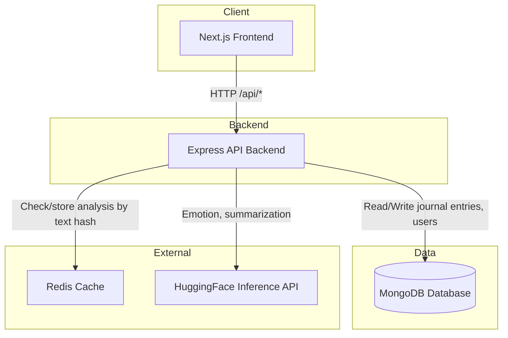

# System Architecture

## Diagram

**Flow:** Next.js Frontend → Express API Backend → MongoDB. The backend also talks to Redis (caching) and HuggingFace (NLP).

---

## Component interactions

- **Next.js Frontend** — Serves the UI (Journal, Insights). Calls the Express backend at `/api/*` for creating entries, listing entries, running analysis, and fetching insights. No direct access to MongoDB, Redis, or HuggingFace.

- **Express API Backend** — Handles all API routes. Persists journal entries and user data in MongoDB. For analysis requests, it checks Redis for a cached result (key = SHA256 of text); on cache miss it calls HuggingFace for emotion and summarization, runs keyword extraction locally with `natural`, merges the result, stores it in Redis (24h TTL), and returns the response. List and insights endpoints read only from MongoDB.

- **MongoDB Database** — Stores users and journal entries (text, ambience, userId, timestamps, optional analysis). Queried for create/list journal and for insights aggregation. Single source of truth for user data.

- **Redis** — Optional cache for analysis results. Key: `sylvanmind:analysis:` + SHA256(trimmed text). Reduces repeat calls to HuggingFace for identical text. If Redis is unavailable, the backend skips cache and still performs analysis.

- **HuggingFace Inference API** — External NLP: emotion classification and summarization. Used only when analysis is requested and (if Redis is used) the result is not cached. Keyword extraction is done in-process with `natural`, not via HuggingFace.
